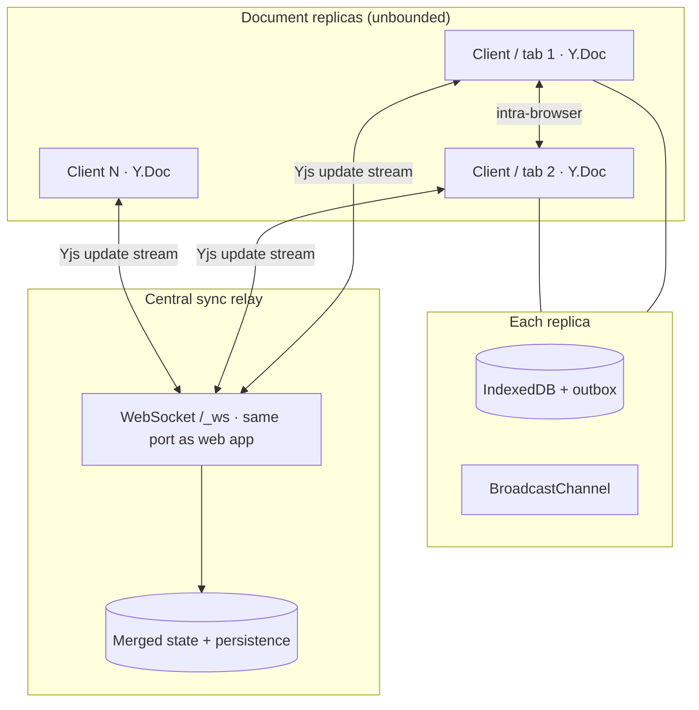

# Local-First Distributed Collaborative Editor

A **distributed, local-first** collaborative document system in **TypeScript**: many independent **replicas** (browsers, tabs, devices) edit the same document concurrently, propagate updates through a **sync relay**, persist locally, and **converge** under partitions and flaky networks, built for real **multi-party** collaboration, not a toy two-window demo.


---

## Why this project

This is a **distributed collaborative editor**: many nodes, one shared document, independent failure and reconnect. The replication story is first-class:

- **Replicas**: every browser/tab/device is a full copy of document state (multi-primary editing).
- **Relay**: WebSocket hub **fan-out** to the replica fleet; merged state for late joiners and recovery.
- **Offline-first**: IndexedDB persists snapshots and queues unsynced deltas until reconnect.
- **Eventual consistency**: concurrent edits converge via **CRDT-backed merge** (Yjs), not last-write-wins on raw strings.

Good fit for demos, coursework, or portfolio work in **distributed systems**, **local-first**, or **full-stack TypeScript**.

---

## Features

| Area | What you get |
|------|----------------|
| **Distributed live editing** | **N replicas** (any mix of browsers, devices, tabs) on one doc; relay **fan-out** keeps the fleet converging in real time. |
| **Offline / partition** | Keep editing when disconnected; pending updates flush on reconnect. |
| **Multi-tab sync** | Same machine, multiple tabs stay aligned via `BroadcastChannel`. |
| **Presence** | See who is in the document and who is actively editing. |
| **Local durability** | Document snapshots and outbox stored in **IndexedDB**. |
| **Server persistence** | Relay merges Yjs state; summaries persisted under `data/` (gitignored). |
| **Dev / demo tools** | Test panel: simulate offline, force sync, inspect state vectors, clear local data. |

---

## Architecture



**High-level flow**

1. User edits title/content → Yjs applies local updates.
2. **Online:** updates go to the WebSocket relay and to other tabs on the same origin.
3. **Offline:** updates are queued in IndexedDB; UI shows pending count.
4. **Reconnect:** client sends state / requests catch-up; relay broadcasts merged state; outbox clears after successful persistence.

---

## Tech stack

- **Frontend:** [Next.js](https://nextjs.org/) (App Router), React 19, Tailwind CSS, Radix UI
- **Replication:** [Yjs](https://github.com/yjs/yjs) (CRDT document model)
- **Transport:** Node `ws` WebSocket relay merged into the Next.js server on a single port (`server/index.ts`, path `/_ws`). A standalone relay (`server/websocket-server.ts`) is also available for advanced/cross-host setups.
- **Browser storage:** IndexedDB (`lib/indexeddb.ts`)
- **API:** Next.js route handlers for document listing (`app/api/documents`)

---

## Prerequisites

- **Node.js** 18+ (20+ recommended)
- **npm**, **pnpm**, or **yarn**

---

## Quick start

A **single process** runs everything: the Next.js app and the WebSocket relay are merged into one custom server (`server/index.ts`) on one port.

### 1. Clone & install

```bash
git clone https://github.com/shivasb42/distributed-collaborative-editor.git
cd distributed-collaborative-editor
npm install
# or: pnpm install
```

### 2. Start the app

```bash
npm run dev
```

Open [http://localhost:3000](http://localhost:3000). The WebSocket relay is served at `/_ws` on the same port, no second process, no extra config.

### 3. Open a document to the fleet

1. Click **New Document** (or pick one from the shared list).
2. **Share the document URL** with collaborators, other laptops on your LAN, phones on Wi‑Fi, extra browser profiles, or multiple tabs on one machine.
3. Everyone edits at once; the relay broadcasts Yjs updates so **all replicas** stay aligned. Presence shows who is in the room.

**Scale-out pattern:** one document ID → many replicas → single relay room → eventual consistency via CRDT merge. Add as many clients as you want; the architecture is **N-replica**, not pairwise.

### Production

```bash
npm run build
npm start            # NODE_ENV=production, honors $PORT
```

### Optional: standalone relay

For advanced setups (e.g. running the sync relay on a separate host from the web app), start the standalone relay and point clients at it:

```bash
npx tsx server/websocket-server.ts          # ws://0.0.0.0:1234 by default
NEXT_PUBLIC_WS_URL=ws://192.168.1.10:1234 npm run dev
```

Without `NEXT_PUBLIC_WS_URL`, clients use the merged relay at same-origin `/_ws` (the default above), and the standalone relay is not needed.

---

## Environment variables

All optional; the default merged-server flow needs none.

| Variable | Default | Description |
|----------|---------|-------------|
| `PORT` | `3000` | Port the merged Next + WebSocket server binds (set by most hosts automatically) |
| `WS_PORT` | `1234` | Port for the **optional** standalone relay (`server/websocket-server.ts`) only |
| `NEXT_PUBLIC_WS_URL` | _(unset → same-origin `/_ws`)_ | Override the client WebSocket URL; set only when using a standalone/remote relay |

---

## Demo ideas (presentations / interviews)

1. **Multi-replica convergence**: spin up several clients on one doc (tabs + devices); show live edits, presence, and connected-peer counts on the relay.
2. **Network partition**: take one replica offline (airplane mode or test panel), keep editing, reconnect the fleet, and show outbox drain + state catch-up.
3. **Replication paths**: contrast **inter-tab** (`BroadcastChannel`) vs **cross-network** (WebSocket relay) as two channels in one distributed editor.
4. **Late joiner**: open a fresh replica mid-session; relay hydrates merged document state so the new node catches up without a full reset.

---

## Project structure

```
├── app/
│   ├── page.tsx              # Document list / home
│   ├── doc/[id]/page.tsx     # Editor route
│   └── api/documents/        # Shared document metadata API
├── components/
│   ├── document-editor-sync.tsx   # Main editor + sync orchestration
│   ├── presence-avatars.tsx
│   └── test-panel.tsx             # Offline simulation & debug
├── hooks/
│   ├── use-websocket-sync.ts      # Cross-device sync
│   ├── use-tab-sync.ts            # Same-browser tab sync
│   └── use-presence.ts
├── lib/
│   ├── indexeddb.ts               # Local persistence + outbox
│   ├── shared-documents.ts        # Server-side JSON persistence
│   └── offline-queue.ts
├── server/
│   └── websocket-server.ts        # Standalone sync relay
└── data/                          # Created at runtime (gitignored)
```

---

## Scripts

| Command | Purpose |
|---------|---------|
| `npm run dev` | Start the merged Next + WebSocket server (dev) on `:3000` |
| `npm run build` | Production build |
| `npm start` | Run the merged server in production (honors `$PORT`) |
| `npm run lint` | ESLint |
| `npx tsx server/websocket-server.ts` | Start the **optional** standalone relay (only for split web/relay hosts) |

---

## Limitations (honest scope)

- **Single relay**: not a multi-node cluster; the WebSocket process is a coordination hub, not consensus (Raft/Paxos).
- **No auth**: anyone with a document URL can join; suitable for demos, not production multi-tenant security.
- **Plain textarea**: rich text / comments / permissions are out of scope.
- **Yjs handles text merge**: the app orchestrates transport, persistence, and UX; conflict-free editing semantics come from Yjs’s CRDT layer.

---


## Acknowledgments

- [Yjs](https://github.com/yjs/yjs): CRDT document replication
- [Local-first software](https://www.inkandswitch.com/local-first/): design inspiration
